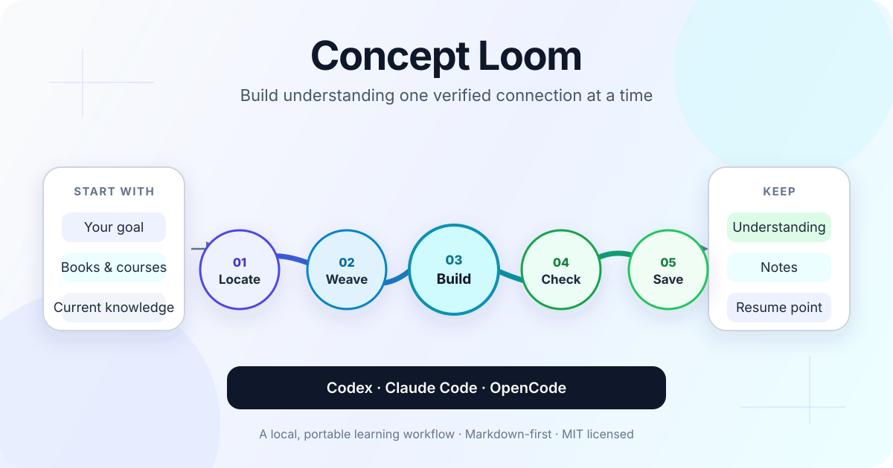

<p align="center">
  
</p>

# Concept Loom

**A portable AI learning workflow for Codex, Claude Code, and OpenCode.**

Version 1.0.0 · MIT licensed · Node.js 20+

[English](#concept-loom) · [Русский](docs/ru/README.md)

Concept Loom turns a coding agent into a structured learning partner. Instead of immediately producing a long explanation, it helps you define a useful goal, finds the edge of your current understanding, proposes a short dependency path, and teaches one connection at a time.

```text
goal → knowledge frontier → learning map → one connection → check → transfer
```

It works with topics you explore from scratch and with your own books, courses, notes, code, and transcripts.

## Why use it?

- Learn toward a practical outcome instead of surveying an entire field.
- Expose gaps and misconceptions before building on them.
- Check understanding with concealed-answer checkpoints.
- Keep concise Markdown learning notes between sessions.
- Use the same workflow in Codex, Claude Code, and OpenCode.
- Show compact text or Mermaid diagrams directly in the conversation.

## Documentation

| Guide | Use it when… |
|---|---|
| [How Concept Loom works](docs/en/how-it-works.md) | You want to understand the method and architecture. |
| [Learning from scratch](docs/en/learning-from-scratch.md) | You are starting without a book or course. |
| [Learning with source materials](docs/en/learning-with-source-materials.md) | You have PDFs, EPUBs, notes, videos, code, or course files. |

Russian documentation starts at [docs/ru/README.md](docs/ru/README.md).

## Quick start with Codex

Requirements: Node.js 20+ and Codex CLI.

```bash
# Install the adapter and register its MCP server automatically
node scripts/setup.mjs codex --target /path/to/learning-workspace

# Start learning
cd /path/to/learning-workspace
codex
```

Use `--skip-mcp` only if you want to install the workspace files without changing the global Codex MCP configuration.

After updating Concept Loom, refresh an already installed skill with `node scripts/setup.mjs codex --target /path/to/learning-workspace --refresh`.

Then ask:

```text
Use $concept-coach. I want to understand database transactions well enough
to choose the right isolation level for a small web application.
```

## Other clients

```bash
node scripts/setup.mjs claude-code --target /path/to/learning-workspace
node scripts/setup.mjs opencode --target /path/to/learning-workspace
```

The installer refuses to overwrite existing configuration. Merge a generated Concept Loom file manually when guidance or MCP configuration already exists.

Concept Loom has no runtime npm dependencies. Small structures are displayed as monospace text diagrams; larger relationship maps are returned as Mermaid blocks that remain readable in the terminal and render in compatible Markdown viewers.

## Verify the project

```bash
npm test
npm run check
```

## License

MIT. Security reports: [SECURITY.md](SECURITY.md). Release history: [CHANGELOG.md](CHANGELOG.md).
